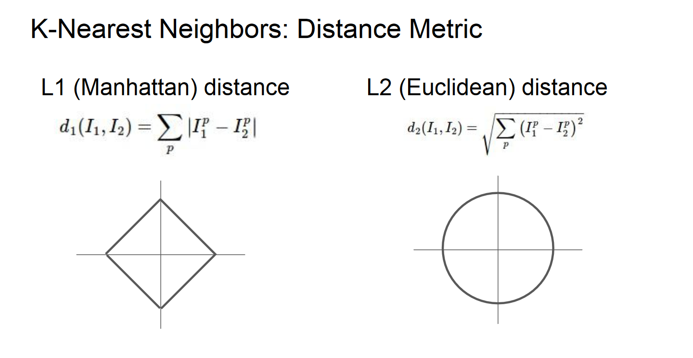
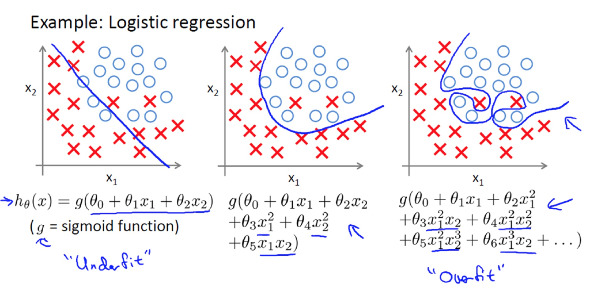
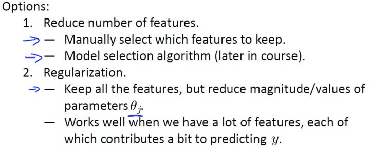
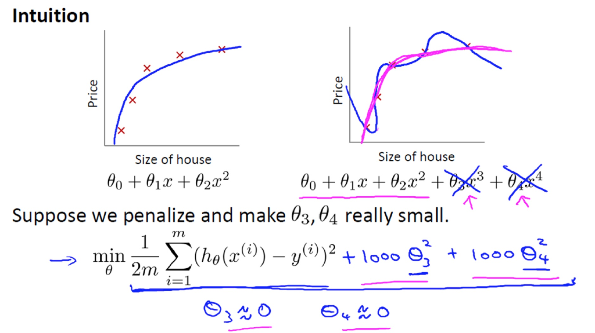

<!-- <script type="text/javascript" src="http://cdn.mathjax.org/mathjax/latest/MathJax.js?config=TeX-AMS-MML_HTMLorMML"></script><script type="text/x-mathjax-config">MathJax.Hub.Config({ tex2jax: {inlineMath: [['$','$'], ['\\(','\\)']]}});</script>
<script type="text/javascript" src="path-to-mathjax/MathJax.js?config=TeX-AMS-MML_HTMLorMML"></script> -->

# Lecture1 Course Introduction

课程相关的[Slides, Notes, Papers](http://cs231n.stanford.edu/syllabus.html)及[花书](https://mitpress.mit.edu/books/deep-learning)作为主要参考材料。

Lecture1根据[Course Materials](https://cs231n.github.io/python-numpy-tutorial/)完成了[Code of Python Numpy Tutorial](https://github.com/V2beach/cs231n/tree/main/python-numpy-tutorial)。

会将我学习到的，课上讲到的核心内容、自己的思考和理解、部分公式的推导、Assignments的代码原理和实现过程整理到本篇及后续的学习报告，以防止走马观花、边学边忘，参考资料都整理在文末，转载请注明出处。

cs231n的课程名是Convolutional Neural Networks for Visual Recognition，即用于视觉识别的卷积神经网络，Lecture 1\~4通过CV和ML基本概念及算法原理讲解了Visual Recognition问题的处理流程和学习DL必要的前置ML知识，我也趁这段时间，借助花书和统计学习方法恶补了必要的数学知识；Lecture 5\~end才从CNN讲起，进入课程主题。

由于GitHub和知乎都不支持LaTeX Formula，只好选择用外部的公式渲染工具将源码转成图片，原公式会陆续上传到[博客](blog.v2beach.cn)。

# Lecture2 Image Classification

### 图像识别的困难
对于人来说，“识别”功能简单至极，但从计算机视觉算法的角度来看，一张图片是以三维数组(e.g. 32x32x3)的形式被存储的，**矩阵中的元素Image[i, j, :]是该点(i, j)像素RGB三个通道的亮度值**，图像识别的困难如下，这些也是做CV任务时需要考虑的关键问题：

视角变化（Viewpoint variation）：同一个物体，摄像机可以从多个角度来展现。

大小变化（Scale variation）：物体可视的大小通常是会变化的。

形变（Deformation）：很多东西的形状并非一成不变，会有很大变化。

遮挡（Occlusion）：目标物体可能被挡住。

光照条件（Illumination conditions）：在像素层面上，光照的影响非常大。

背景干扰（Background clutter）：物体可能混入背景之中，使之难以被辨认。

类内差异（Intra-class variation）：一类物体的个体之间的外形差异很大，比如椅子。

### 向量范数度量图片差异
**范数(Norm)，是具有“长度”概念的函数，为向量空间内的所有向量赋予大小**，L1和L2距离指的就是两个向量的差向量的L1和L2范数，其中向量的L2范数类似于矩阵的F范数。
<div align=center>

</div>

通过slide里这张图，可以直观地理解其定义和差异。

理解上图——标注和公式不必说，图像中的正方形图线和圆形图线，指的其实可以理解为d(I1, I2)确定的情况下，将I1当作坐标原点，I2的所有可能取值，左右公式分别为很熟悉的^2+(y_1-y_0)^2})。

其传达的意思举一个二维例子就很好理解，比如,\vec{I_2}=(1,0),\vec{I_2}-\vec{I_1}=(1,-1)\Rightarrow%20d_1=2,d_2=2)，如果将坐标系逆时针转动45°，,\vec{I_2}=(-\sqrt{2}/2,\sqrt{2}/2),\vec{I_2}-\vec{I_1}=(-\sqrt{2},0)\Rightarrow%20d_1=\sqrt{2},d_2=2)，旋转坐标系会导致L1改变，但L2不变。

直观地理解，当图像包含意义明确的，旋转坐标系或对向量进行其他变换后对其产生影响的特征时，用L1范数衡量距离会优于L2，而如果用的是一些不那么明确的特征，则使用更普遍的L2距离。

另外L1-norm和L2-norm等范数的用途不止于此，作为度量距离的工具时分别被称为曼哈顿距离和欧氏距离，充当损失函数时分别是最小绝对偏差和熟悉的最小二乘误差，用作正则化的时候两种范数都能作为正则项提高模型泛化能力，这时L1倾向于产生稀疏解，而L2对离群值或者异常值比较敏感，更易产生更均匀更稠密的解，而且L2范数或者矩阵的F范数更容易求导，对最优化问题来说计算更简便。

更深入的区别是凸优化的范畴，这里就没有再多学，在实际计算时最好的办法是两种都尝试一下。

### 验证集用于超参数调优及交叉验证
为什么需要验证集来调超参？

通俗地说，加入你用测试集进行多次训练/预测，调参获得的将是对于测试集来说最优的超参组合，相当于测试集上模型的过拟合，这么说或许不太准确，或者可以理解为“数据泄露”，因为测试集模拟的是真实情况下完全未知的数据，**“测试数据集只使用一次，即在训练完成后评价最终的模型时使用。”**

交叉验证——将训练集分为多个folds，每个fold分别作为validation_set进行验证并取评估结果的平均值，如此调参。

### Assignment1 k-NN

在本篇report里assignment部分会分算法原理和代码分析两部分写，通常认为一种机器学习算法由学习系统和预测系统组成<sup>[11](#references)</sup>，学习系统即训练方法，故算法原理分训练和预测两部分写。

##### 算法原理
+ 训练：O(1)，只是将train_set记忆，存到内存里实例化的模型对象中。
+ 预测：O(n)
    + 对每一个test_set点遍历train_set计算距离矩阵dists_matrix(num_test x num_train)；
    + 通过距离矩阵找出离test_set每个点最近的k个train_set点，投票决定该点predict_label。

难点在向量化计算k-NN距离矩阵。<sup>[12](#references)</sup>

##### 代码分析
具体到实现细节上的分析都写在代码注释或者cell里了，注释有很多废话，Inline Question全都有解答，这里不再提，另外如果是重复的代码段只会在第一次出现的地方分析。

分析将严格按照全部相关代码的运行流程进行组织，
+ 某些预操作
    + 引入numpy/matplotlib/scipy等库
    + Python Magic Functions
        + ```%matplotlib inline```内嵌绘图
        + ```%load_ext autoreload %autoreload 2```修改模块后重新加载
+ 数据处理及概况
    + 调用[data_uitls](https://github.com/V2beach/cs231n/blob/main/assignment1/cs231n/data_utils.py)的load_CIFAR10分批次地加载，并切分数据集，本代码中包括train/test，validation需要自己切分跑Cross-validaion
    + 查看数据维度，随机看几组数据，将三维图像合为一维向量以便运算
+ 调试代码
    + 实例化分类器
        + train(X, y) void
        + compute_distances(X) return dists
        + predict_labels(dists, k) return y_predict
        + predict(X, k, num_loops) return y_predict
    + train——self.data = data
    + compute_distances计算距离矩阵——从self里调出数据，分别使用双重循环，单循环和无循环的向量化操作计算train_set和test_set每两张图片像素的L1距离，**向量化（矩阵运算）可以带来跨数量级的效率提升**，其实可以直接用np.linalg.norm()求范数
    + predict_labels计算预测结果——argsort获得跟测试集距离排序后的训练集索引；留下前k个点的labels；bincount进行统计；argmax得到出现次数最多的label
    + predict——根据num_loops选择方式计算dists并传入predict_labels，只是为了比较不同方式计算loss和gradient的速度并直观感受向量化带来的质的变化
+ 交叉验证及训练
    + array_split将原数据集切分为num_folds个array
    + 要调的超参是k，即每个label由k个最近邻决定，循环num_ks次
        + 分别将每个fold作为验证集，其他folds用stack操作合并作为训练集，通过上文“调试代码”下的一系列操作训练/预测多次，计算准确率
    + 超参对应准确率(k, cv accuracy)进行可视化，因为只有一个超参，二维图像很直观且美观
+ 预测及评估

##### k-NN评价
训练的时间复杂度远小于预测，然而忽略了反应图片像素间关联性的大部分有价值的特征细节。

>分类器必须记住所有训练数据并将其存储起来，以便于未来测试数据用于比较。这在存储空间上是低效的，数据集的大小很容易就以GB计。对一个测试图像进行分类需要和所有训练图像作比较，算法计算资源耗费高。

# Lecture3 Loss Functions and Optimization

### 线性分类器

##### Linear Classifier?
从线性分类器可以很自然地过渡到神经网络，这也是后续学习必备的前置知识。所谓Linear Classifier = Score Function + Loss Function，打分函数借助学习到的权重矩阵给每个样本在每个类别上打分，损失函数度量分类得分到真实情况的差距，通过梯度下降方法最优化损失函数可以学习权重。
线性分类器的打分函数均为或，是一个线性映射，=Wx_{i}%2Bb)或=WX%2Bb)，其中W的维度是，注意这里提到的维度是默认向量均为列向量，矩阵在实际实现时基本上全部要转置，即WX会计算为XW。

##### Template matching!
熟悉矩阵运算的话会发现，实际上Weights Matrix的每一行对应一个类别的打分，或者说W的每一个行向量})都是第i类的分类器，对应每个的n个特征。

因此可以将线性分类器看作模板匹配，学习到的权重矩阵W就是模板template或原型prototype，怎么理解呢？WX的线性运算可以看作W的行向量与X的列向量计算内积，可以想象，如果两个图像的像素值越相似（即从计算机的角度上看图像越相似），最后的乘积就越高，就越可能分类相同。

##### Bias trick, Image data preprocessing
+ weights和bias合并
    + 按上述维度，W将b作为列向量，维度变为})
    + 那么X就相应的将加入一行1，维度变为xM})，可以直观地发现，合并后就相当于多了一个维度的值恒为1的特征，意味着给这个特征打分的结果完全取决于weights里的bias。
+ 特征工程的归一化normalization，即notes中提到的图像预处理——所有数据减平均值，再除以最大值，将数据归到\[-1, 1\]，归一化和标准化不同，这又是个较复杂的问题，之后再细讲。

### 损失函数

如上文所说，损失函数衡量的是对学习到的W和其他超参构成的模型的不满意程度，即预测值和真实值之间的差距，主要讨论多类支持向量机损失Multiclass Support Vector Machine Loss（其实就是合页损失）和Softmax分类器的交叉熵损失Cross Entropy两种。可以发现，对于线性分类器来说，其他部分千篇一律，损失函数才是其核心。

##### 再谈正则化
[正则化(Regularization)](#向量范数度量图片差异)上文已经写过一些范数相关的内容，要理解正则化如何防止过拟合就要理解过拟合是什么，关于过拟合发生的本质原因有很多种解释，我对这个问题的理解停留在cs229的程度，吴恩达老师这部分讲得特别好，非常通俗易懂——

简单来说，过拟合是一种在训练集上损失很小拟合程度很高但在测试集上准确率很低预测效果很差的现象，其原因在于模型过于复杂过于贴合训练集导致泛化到其他数据集的能力差，下面几张图都来自cs229的slides和吴老师手写的notes，

<div align=center>

</div>

所谓过于复杂体现在模型对应的函数中就是上图的样子，模型加入了太多的变量（特征或者特征间关联），导致模型过于复杂，目前已经探索出[非常多手段](https://www.zhihu.com/question/59201590/answer/167392763)避免上述情况发生，

<div align=center>

</div>

课上提到其中两种，分别是减少特征数量和正则化，但很多时候很难舍弃某些特征，当你舍弃一部分特征变量时，也舍弃了问题中的一些信息，正则化则是通过降低特征变量参数大小的方式来防止过拟合，

<div align=center>

</div>

正则项也称罚项，正如图中写到的，我常将其抽象地理解为“假装帮助模型进行拟合实则通过自己的强度抑制模型的成长”，可以限制某些特征或者的大小，直观来讲让函数变化没那么曲折，从而降低模型复杂程度，提高泛化能力。

##### 正则化系数

}_\text{regularization%20loss})，其中R(W)以L2-norm正则为例，=\sum_k\sum_l%20W_{k,l}^2)

式中λ即正则化系数，是后续调参非常重要的超参之一，直观地理解，λ即上图中的1000，控制着对模型复杂度的抑制程度，λ和特征变量的系数呈负相关，需要配合其他超参调到一个合适的值以求得更优的模型。

详细的损失函数、包括下面梯度计算的推导过程都在下面两个Assignment1的subtask里面。

### 梯度的理解、最优化原理、梯度计算、梯度下降
关于梯度的内容篇幅最长，原因是这部分内容完全是围绕梯度展开的，**把梯度学透，后面的问题和困难基本上都能迎刃而解**，下面结合[references](#references)里提到的部分资料（不完全赞同他们的理解）分享我对这个问题的理解。
+ 梯度
    + 高维微分——我理解的微分是微小的Δy，而导数是Δy/Δx的极限，可微一定可导，因此，下文可能会不加推导的从可微过渡到可导。以)为例，过去求微分指的仅是对x或y的偏导)或)，或是全导=f^'_x(x_0,y_0)\Delta\x%2B+f^'_y(x_0,y_0)\Delta\y)，只限于沿坐标轴方向求微分求导，但实际上在函数的一个可微处沿坐标系内任何一个方向都可以求其导数，故引入方向向量和方向导数的概念以便后续讨论。
    + 方向导数——同样以三维空间及二维自变量为例，)，轴基向量分别为，设方向向量为任意方向的单位向量，这时有)，x为一个二维向量，为什么f是关于t的映射呢，这里的v范数为1，只用来控制方向，而t才是真正控制大小的自变量，如果恰好等于，那么t其实就是，而f也变成对于的偏函数)了。设方向向量与轴正向夹角为θ，则向量可被分解为，这时上述映射也变成了)，那么沿着方向的方向导数就得到了-f(x_{0}%2Cy_{0})}{t}+})，将这个极限用Nabla劈算子定义一下向量微分，。（从几何意义来理解，三维空间里，方向导数就定义为这个公式，是一个跟偏导数和全导数一样的值，不过不同于另外二者求的是切线斜率，全导数的计算是关于函数曲面的切平面的）
    + 梯度——由公式很容易可以发现，方向导数其实是由方向向量乘另一个向量得到的，而这个向量则正控制着方向导数的大小，我们可以把方向导数拆分为两个向量的内积，其中\vec%20i%2Cf^'_{y}(x%2Cy)\vec%20j)%3D(f^'_{x}(x%2Cy)%2Cf^'_{y}(x%2Cy)))，
    )，是方向向量，**我们就定义另一个控制方向导数大小的向量为梯度**。那么为什么梯度方向是函数在这一点变化最快的方向呢，**所谓函数在某点变化最快即方向导数最大**，看D和V两个向量可以发现，D是由点的位置确定的定值，而变量只有V中的θ，方向导数)，易推得cos(D, V) is 1即同向时方向导数最大，**则证得梯度方向是f变化最快的方向，其模是f最大变化率的值**。
+ 最优化
    + 随机搜索——随机给W赋值，取其中最优
    + 随机本地搜索——随机初始化W，随机尝试多个W的改变方向，选择效果最好的更新W
    + 跟随梯度——沿着上文中的反向，即让Loss Function减小最快的方向更新W
+ 梯度计算
    + 数值梯度法——这种方法其实对应公式}{dx}=\lim_{h+\rightarrow+0}{\frac{f(x%2Bh)-f(x)}{h}+})，用一个趋近于0的h（实际1e-5就足够小）计算有限差值-f(x))来得到梯度，实际中用中心差商公式(centered difference formula)-f(x-h)}{2h})效果会更好。
    + 分析梯度法——微分分析计算梯度即求，在[Assignment1 SVM](#assignment1-svm)和[Assignment1 Softmax](#assignment1-softmax)中均有详细推导，由于这种求法复杂且实现时容易出错，因此一般的求梯度方式是使用分析梯度法训练，在debug时使用数值梯度法进行梯度检查，梯度检查的代码在代码分析中也会提到。
    + 学习率(Learning Rate)——即沿梯度反方向更新W的下降步长，小步长下降稳定但进度慢，大步长进展快但是风险更大。采取大步长可能导致错过最优点，让损失值上升。步长（后面统称为学习率），以及后续内容中的decay学习率衰减（即更新先快后慢，理解了学习率的话，衰减的作用就很好理解），将会是我们在调参中最重要的超参数之一。
+ 梯度下降
    + origin——虽然有其他最优化方法比如LBFGS，但梯度下降是对神经网络的损失函数最优化中最常用的方法，其他方法会增加细节，但核心思想不变。
    ```python
    while True:
        weights_grad = evaluate_gradient(loss_fun, data, weights)
        weights += - step_size * weights_grad
    ```
    + Mini-batch gradient descent——小批量数据的梯度是对整个数据集梯度的近似，计算小批量数据的梯度可以实现更快速地收敛，并以此来进行更频繁的参数更新。这里提几个参数，batch_size即1 batch的样本容量，num_iters即用小批量数据更新参数的次数，1 epoch即所有训练样本跑过一次的过程。
    + Stochastic Gradient Descent(SGD)——随机梯度下降是小批量数据梯度下降的特例，batch_size=1，这个策略在实际情况中非常少见，也被称为在线梯度下降，但很多时候会看见人们不用MGD而用SGD来代指小批量数据梯度下降，另外值得一提的是，batch_size是一个超参，但一般由存储器的限制来决定，而非tune on validation。

### Assignment1 SVM

**之后公式里的矩阵都会按代码中的维度计算，即[Lecture 3](#lecture3-loss-functions-and-optimization)提到的矩阵的转置，将所有数据的维度都了然于胸是理解并实现算法的至关重要的一步。**

设}-\\\\-x^{(2)}-\\\\\vdots\\\\-x^{(m)}-\end{matrix}\right]\in\mathbb%20R^{m\times%20n})，}\\\\y^{(2)}\\\\\vdots\\\\y^{(m)}\end{matrix}\right]\in\mathbb%20R^{m})，，则有其中}_{j}=(x^{(i)}W)_j\in%20R)指第i个样本在第j个类别的得分。

##### 算法原理

+ 训练：
    + 根据=XW)或},W)_j)给m个样本根据n个特征分别打出c个类别的得分。
    + 计算损失，SVM用的是合页损失，公式是}}\left[\max(0,s_j-s_{y^{(i)}}%2B\Delta)\right]%2B\lambda\sum_k\sum_l%20W_{k,l}^2)，比较好理解，其核心思想在于，SVM的合页损失函数想要SVM在正确分类上的得分始终比不正确分类上的得分高出一个边界值Δ，所以每个样本预测的损失就是-(正确分类yi得分-(错误分类j得分+边界))的和}}\max(0,x^{(i)}w_j-x^{(i)}w_{y^{(i)}}%2B\Delta))，这也是计算梯度时将主要分析的式子。
    + 计算梯度，只要不犯像我一样的错误，看到矩阵求导就想系统地学矩阵求导术，按照**碰到矩阵求梯度就逐元素（或者逐向量）求导**的思路，这里的梯度还是比较好求的，将式子展开比如只有三个类别1,2,3且正确分类是类别2，得到}w_1-x^{(i)}w_{2}%2B\Delta)%2B\max(0,x^{(i)}w_3-x^{(i)}w_{2}%2B\Delta))，可以得到当}-s_{y^{(i)}}^{(i)}%2B\Delta%20>0)时，对W求梯度及对W内的向量w1,w2,w3求导，结果会是}}}L_i=x^{(i)},\nabla_{w_{y^{(2)}}}L_i=-2x^{(i)},\nabla_{w_{y^{(3)}}}L_i=x^{(i)})，结合上述易得式}}}L_i=-\left(\sum_{j\neq%20y^{(i)}}\mathbb%201(s_j^{(i)}-s_{y^{(i)}}^{(i)}%2B\Delta%20>0)\right)x^{(i)})，}-s_{y^{(i)}}^{(i)}%2B\Delta%20>0)x^{(i)})，这个梯度公式结合上面我举的例子就很好理解，且由于复合函数较为简单，就没有费力用链式法则而是直接展开，其中花体1是示性函数中的指示函数，括号内容为真则为1，否则为0。
    + 梯度下降，Loop——W减\* learning_rate后重复上述步骤。
+ 预测：
    + 用学习到的权重矩阵W给数据打分；
    + 根据最高分预测类别。

##### 代码分析
+ [预操作](#assignment1-k-nn)
+ [数据处理及概况](#assignment1-k-nn)，不同的是数据集被切分为train/validation/test/dev，且让数据减了平均值（具体特征缩放包括归一化和标准化相关的内容详见[维基百科](https://en.wikipedia.org/wiki/Feature_scaling)），且使用stack将weights和bias合并。
+ 调试代码
    + 实例化分类器
        + class LinearClassifier
            + train(X, y, learning_rate, reg, num_iters, batch_size, verbose), return loss_history
            + predict(X) return y_predict
            + loss(X_batch, y_batch, reg) return loss, gradient
        + subclass LinearSVM(LinearClassifier)继承自线性分类器，重载实现loss(X_batch, y_batch, reg)
            + svm_loss_vectorized(self.W, X_batch, y_batch, reg)
        + class Softmax(LinearClassifier)同样是子类，之后再说
    + train——整个函数就是实现了一个梯度下降，随机初始化权重矩阵self.W，这是个始终存在于LinearClassifier类内的变量，并开始num_iters次循环调用loss函数计算gradient更新W，loss值本身是没用的，记录到history里以可视化训练过程
    + predict——y_predict = argmax(X.dot(self.W), axis=1)，对axis的理解很重要，我的理解都在注释里
    + svm_loss_vectorized——直接循环来算很好写，这里主要写向量化的步骤，
        + 算得分，scores = X.dot(W)
        + 求损失，根据scores计算错误分类得分+Δ和正确分类得分之间的margins，维度m * c，进而根据上文公式算得loss
        + 推梯度，从上文推导的公式可以看出，支持向量机的合页损失梯度向量的各维度在求导之后只剩})，区别只是coeff系数的不同，所以向量化求梯度只需要根据margins > 0求一个包含所有coeff的系数矩阵coefficient_matrix，维度是m * c，梯度gradient就等于(X.T).dot(coefficient_matrix)
    + gradient_check——[梯度检查](https://github.com/V2beach/cs231n/blob/main/assignment1/cs231n/gradient_check.py)像[上文](#梯度的理解最优化原理梯度计算梯度下降)说的一样，用到了中心差商公式，结果跟微分求得的梯度比较达到梯度检查的目的，是实际实现时非常有效的技巧
    + 还有svm, softmax, 整体理解，反向传播，2nn五个要写的内容，前两者和最后一个都是差不多的东西，写完一个剩下的也就差不多了，整体理解也比较好写，难想但是好写，剩下的最关键的就是反向传播了
+ 在验证集上调超参及训练
    + 调参和训练的过程其实是合在一起进行的，这里只需要调learning_rate和regularization_strength两个超参，一边用不同的超参训练模型一边评估在验证集上的预测结果，当尝试完所有的组合，也就得到了用最优组合训练的模型，即LinearClassifier的实例化对象。
+ 预测及评估
+ 权重矩阵可视化，可以发现权重矩阵对应的图像其实拥有对应分类物体的轮廓，这也印证了之前线性分类器是模板匹配的判断

### Assignment1 Softmax

[说在前面](#assignment1-svm)，设}-\\\\-x^{(2)}-\\\\\vdots\\\\-x^{(m)}-\end{matrix}\right]\in\mathbb%20R^{m\times%20n})，}\\\\y^{(2)}\\\\\vdots\\\\y^{(m)}\end{matrix}\right]\in\mathbb%20R^{m})，，则有其中}_{j}=(x^{(i)}W)_j\in%20R)指第i个样本在第j个类别的得分。

Softmax相比SVM对打分多一步转化为概率的处理})=\frac{e^{s^{(i)}_k}}{\sum_je^{s^{(i)}_j}}\in%20R)也可以写作}_{j})，指第i个样本在c个类别中被预测为j的概率，sj和pj是m维列向量，另外。

上传了[手写的推导过程和理解](https://github.com/V2beach/cs231n/tree/main/reports/notes)，里面有很多没整理在report的内容，比如我**对公式中下标的理解（下标和上文提到的维度一样，都是理解和实现算法最基本的也是至关重要的一部分）**，但是观感不太好。

##### 算法原理

+ 训练
    + 根据=XW)或},W)_j)给m个样本根据n个特征分别打出c个类别的得分。
    + 计算损失，Softmax用的是交叉熵损失，将用到的公式有三个，三者拆分自同一个复合函数<br>}\log_e\left(p_k^{(i)}\right)\\\\p_k^{(i)}%26=\frac{e^{s_{k}^{(i)}}}{\sum_j%20e^{s_j^{(i)}}}\\\\s_m^{(i)}%26=\left(x^{(i)}W\right)_m\end{aligned}\end{equation})，<br>下文为了公式易读，会省略大部分上标})，只留},y^{(i)})，非矩阵的向量求导都默认是对样本})来计算的。<br>分别聊一下三个公式的意义，交叉熵——信息论的那块，出自花书，我已经看过很多遍了；Softmax的意义再聊一下，同时注意别跟上下文重复；打分函数很简单。
    + 计算梯度，损失对权重的梯度虽然已经求过一次了，但这里的稍复杂些，所以会用较长篇幅整理更完整的公式，这回求梯度贪心一点，目标不再是只求，也要求，为之后的反向传播和神经网络做一点铺垫——（是熟悉的复合函数求导链式法则！），即，而只需要改变为}})和即可。<br>我们逐个偏导来求，首先求第一个，<br>\\\\%26=-\sum^c_\beta{\p_{i,\beta}}\frac{\partial%20log{p_\beta}}{\partial%20p_\beta}\\\\%26=-\sum^c_\beta{\p_{i,\beta}}\frac{1}{p_\beta}\end{aligned}\end{equation})<br>然后求较简单的第三个，<br>}}{w_m}\right)\\\\%26=\mathbb%201(m=k)x^{(i)}\\\\\frac{\partial%20s_m}{\partial%20x^{(i)}}%20\hspace{0.5in}%26=\frac{\partial}{\partial%20x^{(i)}}\left({x^{(i)}}{w_m}\right)\\\\%26=w_m\\\\\frac{\partial%20s_m}{\partial\textbf%20b}%20\hspace{0.5in}%26=\frac{\partial}{\partial%20\textbf%20b}\left({x^{(i)}}{w_m}%2Bb\right)\\\\%26=1\end{aligned}\end{equation})<br>最后求第二个，<br>\\\\%26=\frac{(e^{s_\beta})^'\sum_j%20e^{s_j}-e^{s_\beta}(\sum_j%20e^{s_j})^'}{(\sum_j%20e^{s_j})^2}\\\\%26=\begin{cases}\frac{e^{s_\beta}\sum_j%20e^{s_j}-e^{s_\beta}e^{s_\beta}}{(\sum_j%20e^{s_j})^2}=p_\beta-p_\beta^2%26\beta%20=m\\\\\frac{-e^{s_\beta}e^{s_m}}{(\sum_j%20e^{s_j})^2}=-p_\beta%20p_m%26\beta%20!=m\end{cases}\end{aligned}\end{equation})<br>将三个偏导用链式法则乘起来，<br>x^{(i)}\end{aligned}\end{equation})<br>其中}))（原因!），且x^{(i)}\end{aligned}\end{equation})（好理解，只有对应的w可以对s产生影响，这样s才可以对w求梯度，[注里写到了原因](#注)，所以这里k直接写为m）<br>则<br>})}\\\\%26=-1(\beta\\\%20\\\%20\\\%20\\\%20\\\%20\text{is}\\\%20\\\%20\\\%20\\\%20y^{(i)})\end{aligned}\end{equation})，且}\end{aligned}\end{equation})，<br>这时，<br>}}}\frac{\partial%20p_{y^{(i)}}}{\partial%20s_m}\frac{\partial%20s_m}{\partial%20w_m}\\\\%26={x^{(i)}}^T\times{\begin{cases}p_{y^{(i)}}-1%26m=y^{(i)}\\\\p_m%26m!=y^{(i)}\end{cases}}\end{aligned}\end{equation})<br>同理可得（简化了一下公式），<br>}}L_i%26=\left(p_m-\mathbb1(m=y^{(i)})\right)\times%20w_m^T\end{aligned}\end{equation})<br>})\end{aligned}\end{equation})，<br>实际计算时要时刻清楚各矩阵维度，否则很容易乱套。
    + 梯度下降，Loop——W减\* learning_rate后重复上述步骤。
+ 预测
    + 用学习到的权重矩阵W给数据打分；
    + 根据最高分预测类别。

##### 代码分析

其实现跟svm基本相同，仅有些许区别，但为了结构完整把全过程又写了一遍。

+ [预操作](#assignment1-svm)
+ [数据处理及概况](#assignment1-svm)
+ 调试代码
    + 实例化分类器
        + class LinearClassifier
            + train(X, y, learning_rate, reg, num_iters, batch_size, verbose), return loss_history
            + predict(X) return y_predict
            + loss(X_batch, y_batch, reg) return loss, gradient
        + class LinearSVM(LinearClassifier)
        + subclass Softmax(LinearClassifier)
            + softmax_loss_vectorized(self.W, X_batch, y_batch, reg)
    + train——整个函数就是实现了一个梯度下降，随机初始化权重矩阵self.W，这是个始终存在于LinearClassifier类内的变量，并开始num_iters次循环调用loss函数计算gradient更新W，loss值本身是没用的，记录到history里以可视化训练过程
    + predict——y_predict = argmax(X.dot(self.W), axis=1)，对axis的理解很重要，我的理解都在注释里
    + softmax_loss_vectorized——不同于svm，softmax的公式本身就是矩阵乘积的形式，所以循环和向量化的写法都很好写，
        + 算得分，scores = X.dot(W)
        + 变概率，probability = softmax(scores)
        + 求损失，根据probability和交叉熵公式计算loss
        + 推梯度，用上文的梯度公式易求得gradient
    + gradient_check——[梯度检查](https://github.com/V2beach/cs231n/blob/main/assignment1/cs231n/gradient_check.py)像[上文](#梯度的理解最优化原理梯度计算梯度下降)说的一样，用到了中心差商公式，结果跟微分求得的梯度比较达到梯度检查的目的，是实际实现时非常有效的技巧
+ 在验证集上调超参及训练
    + 调参和训练的过程其实是合在一起进行的，这里只需要调learning_rate和regularization_strength两个超参，一边用不同的超参训练模型一边评估在验证集上的预测结果，当尝试完所有的组合，也就得到了用最优组合训练的模型，即LinearClassifier的实例化对象。
+ 预测及评估
+ 权重矩阵可视化，可以发现权重矩阵对应的图像其实拥有对应分类物体的轮廓，这也印证了之前线性分类器是模板匹配的判断

##### 注——
[这个问题](#assignment1-softmax)来自Lecture3且其思想在求导求梯度相关的计算中随处可见，但有时可能会因为矩阵计算比较复杂而想不明白，其实很简单，如果a改变不会引起b的改变，即a对b无影响，或者更形式化地说，那么b关于a求方向导数一定为0。

？？？

所以要...使用小而具体的例子：有些读者可能觉得向量化操作的梯度计算比较困难，建议是写出一个很小很明确的向量化例子，在纸上演算梯度，然后对其一般化，得到一个高效的向量化操作形式。

### SVM和Softmax比较及借助linear classifier demo整体理解

<div align=center>

</div>

[knn and linear classifier demos](http://vision.stanford.edu/teaching/cs231n-demos/)，我也在这个repo里做了[备份](https://github.com/V2beach/cs231n/tree/main/demos)，以防今后网站迁移或域名更改。

整体上理解，比如svm是试图让决策边界/决策超平面距离两个类别的数据尽量远；交叉熵和其他损失的区别之类的。

# Lecture4 Neural Networks and Backpropagation

### 反向传播及相关知识
最关键的一个算法之一

### Assignment1 Two-Layer Neural Network
用到了bp的思想但是没有模块化计算。
##### 算法原理
##### 代码分析

先把体力活干完，softmax和2-nn，之后再补充，记得softmax的“铺垫”。
一个小时只能写一页latex源码，绝对不能这么写了，找效率高的办法，
从今往后再也不会徒手码公式了。

之前初学的时候时常卡在很多细枝末节的地方，且总苦于搜不到多少讲得透彻的中文资料，所以借最近学cs231n的机会，本着开放分享的互联网精神，写了一个指南向的报告，可以为入门的伙计们提供一点新的思路。

# References
\[1\] [L1-norm和L2-norm两种范数的特点和区别？- Andy Yang](https://www.zhihu.com/question/26485586/answer/616029832)

\[2\] [CS231n官方笔记授权翻译 - 杜克et al.](https://zhuanlan.zhihu.com/p/21930884)

\[3\] [image classification notes](http://cs231n.github.io/classification), [linear classification notes](http://cs231n.github.io/linear-classify), [optimization notes](http://cs231n.github.io/optimization-1), [backprop notes](http://cs231n.github.io/optimization-2) - Fei-Fei Li et al.

\[4\] [cs229 Machine Learning - 吴恩达](https://www.coursera.org/learn/machine-learning)

\[5\] [机器学习中使用正则化来防止过拟合是什么原理？- 叶芃](https://www.zhihu.com/question/20700829/answer/119314862)

\[6\] [全微分 - 维基百科](https://zh.wikipedia.org/wiki/全微分)

\[7\] [如何直观形象的理解方向导数与梯度以及它们之间的关系？- 马同学](https://www.zhihu.com/question/36301367/answer/156102040)

\[8\] [如何直观形象的理解方向导数与梯度以及它们之间的关系？- 忆臻](https://www.zhihu.com/question/36301367/answer/142096153)

\[9\] [梯度是向量，方向导数是一个数 - BoniuPoniu](https://blog.csdn.net/weixin_43702920/article/details/107435227)

\[10\] [统计学习方法 - 李航](https://www.google.com/)

\[11\] [CS231 作业1 - Doraemonzzz](https://doraemonzzz.com/2019/03/02/CS231%20作业1/)

\[12\] [Softmax损失函数及梯度的计算 - 杨勇](https://zhuanlan.zhihu.com/p/21485970)

\[13\] [详解softmax函数以及相关求导过程 - 忆臻](https://zhuanlan.zhihu.com/p/25723112)（SCIR）