# Lecture1 Course Introduction

课程相关的[Slides, Notes, Papers](http://cs231n.stanford.edu/)及[花书](https://mitpress.mit.edu/books/deep-learning)作为主要参考材料。

Lecture1根据[Course Materials](https://cs231n.github.io/python-numpy-tutorial/)完成了[Code of Python Numpy Tutorial](https://github.com/V2beach/cs231n/tree/main/python-numpy-tutorial)。

会将我学习到的，课上讲到的核心内容、自己的思考和理解、部分公式的推导、Assignments的代码原理和实现过程整理到本篇及后续的学习报告，以防止走马观花。

参考资料都整理在文末，转载请注明出处。

cs231n的课程名是Convolutional Neural Networks for Visual Recognition，即用于视觉识别的卷积神经网络，Lecture 1\~4通过CV和ML基本概念及算法原理讲解了Visual Recognition问题的处理流程和学习DL必要的前置ML知识，我也趁这段时间，借助花书和统计学习方法恶补了必要的数学知识；Lecture 5\~end才从CNN讲起，进入课程主题。

# Lecture2 Image Classification

### 图像识别的困难
对于人来说，“识别”功能简单至极，但从计算机视觉算法的角度来看，一张图片是以三维数组(e.g. 32x32x3)的形式被存储的，**矩阵中的元素Image[i, j, :]是该点(i, j)像素RGB三个通道的亮度值**，图像识别的困难如下，这些也是做CV任务时需要考虑的关键问题：

视角变化（Viewpoint variation）：同一个物体，摄像机可以从多个角度来展现。

大小变化（Scale variation）：物体可视的大小通常是会变化的。

形变（Deformation）：很多东西的形状并非一成不变，会有很大变化。

遮挡（Occlusion）：目标物体可能被挡住。

光照条件（Illumination conditions）：在像素层面上，光照的影响非常大。

背景干扰（Background clutter）：物体可能混入背景之中，使之难以被辨认。

类内差异（Intra-class variation）：一类物体的个体之间的外形差异很大，比如椅子。

### 向量范数度量图片差异
**范数(Norm)，是具有“长度”概念的函数，为向量空间内的所有向量赋予大小**，L1和L2距离指的就是两个向量的差向量的L1和L2范数，其中向量的L2范数类似于矩阵的F范数。
<div align=center>
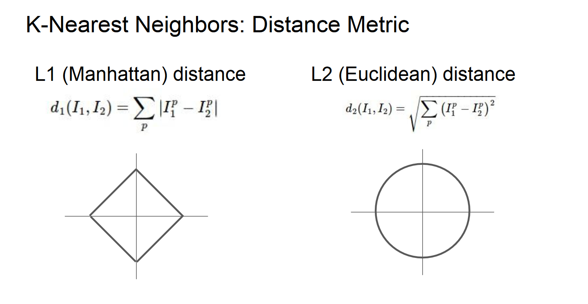
</div>

通过slide里这张图，可以直观地理解其定义和差异。

理解上图——标注和公式不必说，图像中的正方形图线和圆形图线，其实可以理解为d(I1, I2)确定的情况下，将I1当作坐标原点时I2的所有可能取值，左右公式分别为很熟悉的$d_1=|x_1-x_0|+|y_1-y_0|, \ \ d_2=\sqrt{(x_1-x_0)^2+(y_1-y_0)^2}$。(I1(x0, y0), I2(x1, y1))

其传达的意思举一个二维例子就很好理解，比如$\vec{I_1}=(0, 1),\vec{I_2}=(1,0),\vec{I_2}-\vec{I_1}=(1,-1)\Rightarrow d_1=2,d_2=2$，如果将坐标系逆时针转动45°，$\vec{I_1}=(\sqrt{2}/2,\sqrt{2}/2),\vec{I_2}=(-\sqrt{2}/2,\sqrt{2}/2),\vec{I_2}-\vec{I_1}=(-\sqrt{2},0)\Rightarrow d_1=\sqrt{2},d_2=2$，旋转坐标系会导致L1改变，但L2不变。

直观地理解，当图像包含意义明确的，旋转坐标系或对向量进行其他变换后对其产生影响的特征时，用L1范数衡量距离会优于L2，而如果用的是一些不那么明确的特征，则使用更普遍的L2距离。

另外L1-norm和L2-norm等范数的用途不止于此，作为度量距离的工具时分别被称为曼哈顿距离和欧氏距离，充当损失函数时分别是最小绝对偏差和熟悉的最小二乘误差，用作正则化的时候两种范数都能作为正则项提高模型泛化能力，这时L1倾向于产生稀疏解，而L2对离群值或者异常值比较敏感，更易产生更均匀更稠密的解，而且L2范数或者矩阵的F范数更容易求导，对最优化问题来说计算更简便。

更深入的区别是凸优化的范畴，这里就没有再多学，在实际计算时最好的办法是两种都尝试一下。

### 验证集用于超参数调优及交叉验证
为什么需要验证集来调超参？

通俗地说，加入你用测试集进行多次训练/预测，调参获得的将是对于测试集来说最优的超参组合，相当于测试集上模型的过拟合，这么说或许不太准确，或者可以理解为“数据泄露”，因为测试集模拟的是真实情况下完全未知的数据，**“测试数据集只使用一次，即在训练完成后评价最终的模型时使用。”**

交叉验证——将训练集分为多个folds，每个fold分别作为validation_set进行验证并取评估结果的平均值，如此调参。

### Assignment1 k-NN

在本篇report里assignment部分会分算法原理和代码分析两部分写，通常认为一种机器学习算法由学习系统和预测系统组成<sup>[11](#references)</sup>，学习系统即训练方法，故算法原理分训练和预测两部分写。

##### 算法原理
+ 训练：O(1)，只是将train_set记忆，存到内存里实例化的模型对象中。
+ 预测：O(n)
    + 对每一个test_set点遍历train_set计算距离矩阵dists_matrix(num_test x num_train)；
    + 通过距离矩阵找出离test_set每个点最近的k个train_set点，投票决定该点predict_label。

难点在向量化计算k-NN距离矩阵。<sup>[12](#references)</sup>

##### 代码分析
具体到实现细节上的分析都写在代码注释或者cell里了，注释有很多废话，Inline Question全都有解答，这里不再提，另外如果是重复的代码段只会在第一次出现的地方分析。

分析将严格按照全部相关代码的运行流程进行组织，
+ 某些预操作
    + 引入numpy/matplotlib/scipy等库
    + Python Magic Functions
        + ```%matplotlib inline```内嵌绘图
        + ```%load_ext autoreload %autoreload 2```修改模块后重新加载
+ 数据处理及概况
    + 调用[data_uitls](https://github.com/V2beach/cs231n/blob/main/assignment1/cs231n/data_utils.py)的load_CIFAR10分批次地加载，并切分数据集，本代码中包括train/test，validation需要自己切分跑Cross-validaion
    + 查看数据维度，随机看几组数据，将三维图像合为一维向量以便运算
+ 调试代码
    + 实例化分类器
        + train(X, y) void
        + compute_distances(X) return dists
        + predict_labels(dists, k) return y_predict
        + predict(X, k, num_loops) return y_predict
    + train——self.data = data
    + compute_distances计算距离矩阵——从self里调出数据，分别使用双重循环，单循环和无循环的向量化操作计算train_set和test_set每两张图片像素的L1距离，**向量化（矩阵运算）可以带来跨数量级的效率提升**，其实可以直接用np.linalg.norm()求范数
    + predict_labels计算预测结果——argsort获得跟测试集距离排序后的训练集索引；留下前k个点的labels；bincount进行统计；argmax得到出现次数最多的label
    + predict——根据num_loops选择方式计算dists并传入predict_labels，只是为了比较不同方式计算loss和gradient的速度并直观感受向量化带来的质的变化
+ 交叉验证及训练
    + array_split将原数据集切分为num_folds个array
    + 要调的超参是k，即每个label由k个最近邻决定，循环num_ks次
        + 分别将每个fold作为验证集，其他folds用stack操作合并作为训练集，通过上文“调试代码”下的一系列操作训练/预测多次，计算准确率
    + 超参对应准确率(k, cv accuracy)进行可视化，因为只有一个超参，二维图像很直观且美观
+ 预测及评估

##### k-NN评价
训练的时间复杂度远小于预测，忽略了反应图片像素间关联性的大部分有价值的特征细节。

>分类器必须记住所有训练数据并将其存储起来，以便于未来测试数据用于比较。这在存储空间上是低效的，数据集的大小很容易就以GB计。对一个测试图像进行分类需要和所有训练图像作比较，算法计算资源耗费高。

# Lecture3 Loss Functions and Optimization

### 线性分类器

##### Linear Classifier?
从线性分类器可以很自然地过渡到神经网络，这也是后续学习必备的前置知识。所谓Linear Classifier = Score Function + Loss Function，打分函数借助学习到的权重矩阵给每个样本在每个类别上打分，损失函数度量分类得分到真实情况的差距，通过梯度下降方法最优化损失函数可以学习权重。
线性分类器的打分函数均为$f:\mathbb{R}^N\mapsto \mathbb{R}^C$或$f:\mathbb{R}^{N\times M}\mapsto \mathbb{R}^{C\times M}$，是一个线性映射，$f(x_i,W,b)=Wx_{i} + b$或$f(X,W,b)=WX + b$，其中W的维度是$\mathbb{R}^{C\times N}$，注意这里提到的维度是默认向量均为列向量，矩阵在实际实现时基本上全部要转置，即WX会计算为XW。

##### Template matching!
熟悉矩阵运算的话会发现，实际上Weights Matrix的每一行对应一个类别的打分，或者说W的每一个行向量$W_{i(0\sim  c)}$都是第i类的分类器，对应每个$x^i$的n个特征。

因此可以将线性分类器看作模板匹配，学习到的权重矩阵W就是模板template或原型prototype，怎么理解呢？WX的线性运算可以看作W的行向量与X的列向量计算内积，可以想象，如果两个图像的像素值越相似（即从计算机的角度上看图像越相似），最后的乘积就越高，就越可能分类相同。

##### Bias trick, Image data preprocessing
+ weights和bias合并
    + 按上述维度，W将b作为列向量，维度变为$\mathbb{R}^{C\times (N + 1)}$
    + 那么X就相应的将加入一行1，维度变为$\mathbb{R}^{(N + 1)\times M}$，可以直观地发现，合并后就相当于多了一个维度的值恒为1的特征，意味着给这个特征打分的结果完全取决于weights里的bias。
+ 特征工程的归一化normalization，即notes中提到的图像预处理——所有数据减平均值，再除以最大值，将数据归到\[-1, 1\]，归一化和标准化不同，这又是个较复杂的问题，之后再细讲。

### 损失函数

如上文所说，损失函数衡量的是对学习到的W和其他超参构成的模型的不满意程度，即预测值和真实值之间的差距，主要讨论多类支持向量机损失Multiclass Support Vector Machine Loss（其实就是合页损失）和Softmax分类器的softmax函数+交叉熵损失Cross Entropy两种。可以发现，对于线性分类器来说，其他部分（模型空间，梯度下降算法）千篇一律，损失函数才是其核心。

##### 再谈正则化
[正则化(Regularization)](#向量范数度量图片差异)上文已经写过一些范数相关的内容，要理解正则化如何防止过拟合就要理解过拟合是什么，关于过拟合发生的本质原因有很多种解释，我对这个问题的理解停留在[cs229 Machine Learning](http://cs229.stanford.edu/)的程度，吴恩达老师这部分讲得特别好，非常通俗易懂——

简单来说，过拟合是一种在训练集上损失很小拟合程度很高但在测试集上准确率很低预测效果很差的现象，其原因在于模型过于复杂过于贴合训练集导致泛化到其他数据集的能力差，下面几张图都来自cs229的slides和吴老师手写的notes，

<div align=center>
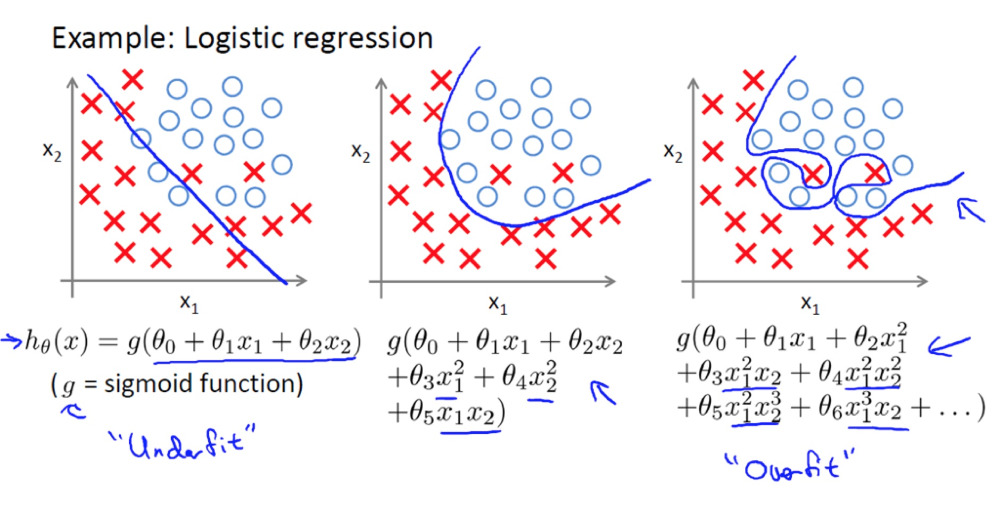
</div>

所谓过于复杂体现在模型对应的函数中就是上图的样子，模型加入了太多的变量（特征或者特征间关联），导致模型过于复杂，目前已经探索出[非常多手段](https://www.zhihu.com/question/59201590/answer/167392763)避免上述情况发生，

<div align=center>
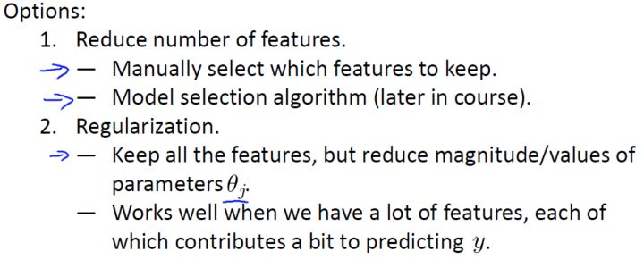
</div>

课上提到其中两种，分别是减少特征数量和正则化，但很多时候很难舍弃某些特征，当你舍弃一部分特征变量时，也舍弃了问题中的一些信息，正则化则是通过降低特征变量参数大小的方式来防止过拟合，

<div align=center>
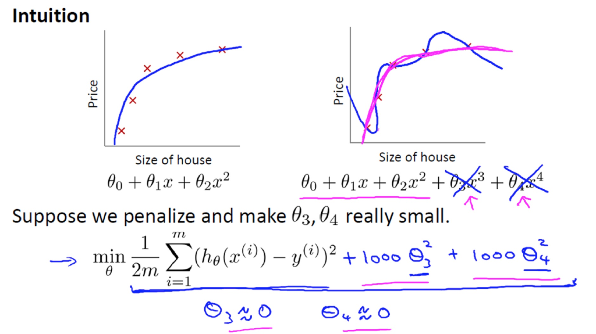
</div>

正则项也称罚项，正如图中写到的，我常将其抽象地理解为“假装帮助模型进行拟合实则通过自己的强度抑制模型的成长”，可以限制某些特征$\theta$或者$W$的大小，直观来讲让函数变化没那么曲折，从而降低模型复杂程度，提高泛化能力。

##### 正则化系数

$L=\underbrace{\frac{1}{N}\sum_i L_i}_\text{data loss} + \underbrace{\lambda R(W)}_\text{regularization loss}$，其中R(W)以L2-norm正则为例，$R(W)=\sum_k\sum_l W_{k,l}^2$

式中λ即正则化系数，是后续调参非常重要的超参之一，直观地理解，λ即上图中的1000，控制着对模型复杂度的抑制程度，λ和特征变量的系数呈负相关，需要配合其他超参调到一个合适的值以求得更优的模型。

详细的损失函数、包括下面梯度计算的推导过程都在下面两个Assignment1的subtask里面。

### 梯度的理解、最优化原理、梯度计算、梯度下降
根据[线性分类器](#线性分类器)和[损失函数](#损失函数)的学习可以发现，要得到最强的预测能力，就要有最好的打分函数，就要计算出一个让打分函数最优的W，要做到这一点，就需要最小化度量预测值和真实值之间的差距的关于W的损失函数，这就是最优化，而学习优化过程必然要讨论梯度计算。

关于梯度的内容篇幅最长，原因是这部分内容完全是围绕梯度展开的，**把梯度学透，后面的问题和困难基本上都能迎刃而解**，下面结合[references](#references)里提到的部分资料（不完全赞同他们的理解）分享我对这个问题的理解。(slope = tan(theta))
+ 梯度
    + 高维微分——微分是微小的Δy，而导数是Δy/Δx的极限，可微一定可导，因此，下文可能会不加推导的从可微过渡到可导。以$z=f(x,y)$为例，过去求微分指的仅是对x或y的偏导$f_x'(x, y)$或$f_y'(x,y)$，或是全导$dz|_{x_0,y_0}=f'(x_0,y_0)=f'_x(x_0,y_0)\Delta x + f'_y(x_0,y_0)\Delta y$，只限于沿坐标轴方向求微分求导，但实际上在函数的一个可微处沿坐标系内任何一个方向都可以求其导数，故引入方向向量和方向导数的概念以便后续讨论。
    + 方向导数——同样以三维空间及二维自变量为例，$y=f(x_0,x_1)$，$x_0,x_1$轴基向量分别为$\vec{i},\vec{j}$，设方向向量$\vec{v}$为任意方向的单位向量，这时有$f_v:t\rightarrow f(\vec{x} + t\vec{v})$，x为一个二维向量，为什么f是关于t的映射呢，这里的v范数为1，只用来控制方向，而t才是真正控制大小的自变量，如果$\vec{v}$恰好等于$\vec{i}$，那么t其实就是$\Delta x_0$，而f也变成对于$x_0$的偏函数$f_v=(x_0 + \Delta x_0,x_1)$了。设方向向量与$x_0$轴正向夹角为θ，则向量$\vec{v}$可被分解为$cos\theta\vec{i} + sin\theta\vec{j}$，这时上述映射也变成了$f_v:t\rightarrow f(x_0 + sin\theta t,x_1 + cos\theta t)$，那么沿着$\vec{v}$方向的方向导数就得到了$\lim_{t\rightarrow 0}{\frac{f(x_{0} + tcos\theta , y_{0} + tsin\theta)-f(x_{0} , y_{0})}{t}}$，将这个极限用Nabla劈算子定义一下向量微分，$\nabla_{v}f(x , y)=f'_{x}(x , y)cos\theta+f'_{y}(x , y)sin\theta$。（从几何意义来理解，三维空间里，方向导数就定义为这个公式，不过不同于另外二者求的是切线斜率，全导数的计算是关于函数曲面的切平面的）
    + 梯度——由公式$\nabla_{v}f(x , y)=f'_{x}(x , y)cos\theta + f'_{y}(x , y)sin\theta$很容易可以发现，方向导数其实是由方向向量乘另一个向量得到的，而这个向量则正控制着方向导数的大小，我们可以把方向导数拆分为两个向量的内积$D\cdot V$，其中$D=(f'_{x}(x , y)\vec i , f'_{y}(x , y)\vec j)=(f'_{x}(x , y) , f'_{y}(x , y))$，
    $V=(cos\theta , sin\theta)$，$V$是方向向量，**我们就定义另一个控制方向导数大小的向量$D$为梯度$\text{grad} f$**。那么为什么梯度方向是函数在这一点变化最快的方向呢，**所谓函数在某点变化最快即方向导数最大**，看D和V两个向量可以发现，D是由点的位置确定的定值，而变量只有V中的θ，方向导数$\nabla_{v}f(x , y)=f'_{x}(x , y)cos\theta + f'_{y}(x , y)sin\theta=D\cdot V=\mid D\mid cos(D,V)$，易推得cos(D, V) is 1即同向时方向导数最大，**则证得梯度$\text{grad} f$方向是f变化最快的方向，其模是f最大变化率的值**。
+ 最优化
    + 随机搜索——随机给W赋值，取其中最优
    + 随机本地搜索——随机初始化W，随机尝试多个W的改变方向，选择效果最好的更新W
    + 跟随梯度——沿着上文中$\text{grad} f$的反向，即让Loss Function减小最快的方向更新W
+ 梯度计算
    + 数值梯度法——这种方法其实对应公式$\frac{df(x)}{dx}=\lim_{h\rightarrow0}{\frac{f(x + h)-f(x)}{h}}$，用一个趋近于0的h（实际1e-5就足够小）计算有限差值$f(x + h)-f(x)$来得到梯度，实际中用中心差商公式(centered difference formula)$\frac{f(x + h)-f(x-h)}{2h}$效果会更好。
    + 分析梯度法——微分分析计算梯度即求$\nabla _W L$，在[Assignment1 SVM](#assignment1-svm)和[Assignment1 Softmax](#assignment1-softmax)中均有详细推导，由于这种求法复杂且实现时容易出错，因此一般的求梯度方式是使用分析梯度法训练，在debug时使用数值梯度法进行梯度检查，梯度检查的代码在代码分析中也会提到。
    + 学习率(Learning Rate)——即沿梯度反方向更新W的下降步长，小步长下降稳定但进度慢，大步长进展快但是风险更大。采取大步长可能导致错过最优点，让损失值上升。步长（后面统称为学习率），以及后续内容中的decay学习率衰减（即更新先快后慢，理解了学习率的话，衰减的作用就很好理解），将会是在调参中最重要的超参数之一。
+ 梯度下降
    + origin——虽然有其他最优化方法比如LBFGS，但梯度下降是对神经网络的损失函数最优化中最常用的方法，其他方法会增加细节，但核心思想不变。
    ```python
    while True:
        weights_grad = evaluate_gradient(loss_fun, data, weights)
        weights += - step_size * weights_grad
    ```
    + Mini-batch gradient descent——小批量数据的梯度是对整个数据集梯度的近似，计算小批量数据的梯度可以实现更快速地收敛，并以此来进行更频繁的参数更新。这里提几个参数，batch_size即1 batch的样本容量，num_iters即用小批量数据更新参数的次数，1 epoch即所有训练样本跑过一次的过程。
    + Stochastic Gradient Descent(SGD)——随机梯度下降是小批量数据梯度下降的特例，batch_size=1，这个策略在实际情况中非常少见，也被称为在线梯度下降，但很多时候会看见人们不用MGD而用SGD来代指小批量数据梯度下降，另外值得一提的是，batch_size是一个超参，但一般由存储器的限制来决定，而非tune on validation。

### Assignment1 SVM

**之后公式里的矩阵都会按代码中的维度计算，即[Lecture 3](#lecture3-loss-functions-and-optimization)提到的矩阵的转置，将所有数据的维度都了然于胸是理解并实现算法的至关重要的一步。**

设$X=\left[\begin{matrix}-x^{(1)}- \\ -x^{(2)}- \\ \vdots \\ -x^{(m)}-\end{matrix}\right]\in\mathbb R^{m\times n}$，$\vec y=\left[\begin{matrix}y^{(1)} \\ y^{(2)} \\ \vdots \\ y^{(m)}\end{matrix}\right]\in\mathbb R^{m}$，$W=\left[\begin{matrix}\mid \\ w_{1},w_{2},\dots,w_{c} \\ \mid\end{matrix}\right]\in\mathbb R^{n\times c}$，则有$S=XW\in\mathbb R^{m\times c}$其中$s^{(i)}_{j}=(x^{(i)}W)_j\in R$指第i个样本在第j个类别的得分。

##### 算法原理

+ 训练：
    + 根据$S=f(X ; W)=XW$或$s_j=f(x^{(i)},W)_j$给m个样本根据n个特征分别打出c个类别的得分。
    + 计算损失，SVM用的是合页损失，公式是$L=\frac{1}{N}\sum_i\sum_{j\neq y^{(i)}}\left[\max(0,s_j-s_{y^{(i)}} + \Delta)\right] + \lambda\sum_k\sum_l W_{k,l}^2$，公式必须要逐字母地读懂，比较好理解，其核心思想在于，SVM的合页损失函数想要SVM在正确分类上的得分始终比不正确分类上的得分高出一个边界值Δ，所以每个样本预测的损失就是-(正确分类yi得分-(错误分类j得分+边界))的和$L_i=\sum_{j\neq y^{(i)}}\max(0,x^{(i)}w_j-x^{(i)}w_{y^{(i)}} + \Delta)$，这也是计算梯度时将主要分析的式子，有关svm/softmax的完整理解请见[理解svm和softmax](#svm和softmax比较及linear-classifier-demo)。
    + 计算梯度，只要不犯像我一样的错误，看到矩阵求导就想系统地学矩阵求导术，按照**碰到矩阵求梯度就逐元素（或者逐向量）求导**的思路，这里的梯度还是比较好求的，将式子展开比如只有三个类别1,2,3且正确分类是类别2，得到$L_i=\max(0,x^{(i)}w_1-x^{(i)}w_{2} + \Delta) + \max(0,x^{(i)}w_3-x^{(i)}w_{2} + \Delta)$，可以得到当$s_j^{(i)}-s_{y^{(i)}}^{(i)} + \Delta >0$时，对W求梯度及对W内的向量w1,w2,w3求导，结果会是$\nabla_{w_{y^{(1)}}}L_i=x^{(i)},\nabla_{w_{y^{(2)}}}L_i=-2x^{(i)},\nabla_{w_{y^{(3)}}}L_i=x^{(i)}$，结合上述易得式$\nabla_{w_{y^{(i)}}}L_i=-\left(\sum_{j\neq y^{(i)}}\mathbb 1(s_j^{(i)}-s_{y^{(i)}}^{(i)} + \Delta >0)\right)x^{(i)}$，$\nabla_{w_{j}}L_i=\mathbb 1(s_j^{(i)}-s_{y^{(i)}}^{(i)} + \Delta >0)x^{(i)}$，这个梯度公式结合上面我举的例子就很好理解，且由于复合函数较为简单，就没有费力用链式法则而是直接展开，其中花体1是示性函数中的指示函数，括号内容为真则为1，否则为0。
    + 梯度下降，Loop——W减$\nabla_WL$\* learning_rate后重复上述步骤。
+ 预测：
    + 用学习到的权重矩阵W给数据打分；
    + 根据最高分预测类别。

##### 代码分析
+ [预操作](#assignment1-k-nn)
+ [数据处理及概况](#assignment1-k-nn)，不同的是数据集被切分为train/validation/test/dev，且让数据减了平均值（具体特征缩放包括归一化和标准化相关的内容详见[维基百科](https://en.wikipedia.org/wiki/Feature_scaling)），且使用stack将weights和bias合并。
+ 调试代码
    + 实例化分类器
        + class LinearClassifier
            + train(X, y, learning_rate, reg, num_iters, batch_size, verbose), return loss_history
            + predict(X) return y_predict
            + loss(X_batch, y_batch, reg) return loss, gradient
        + subclass LinearSVM(LinearClassifier)继承自线性分类器，重载实现loss(X_batch, y_batch, reg)
            + svm_loss_vectorized(self.W, X_batch, y_batch, reg)
        + class Softmax(LinearClassifier)同样是子类，之后再说
    + train——整个函数就是实现了一个梯度下降，随机初始化权重矩阵self.W，这是个始终存在于LinearClassifier类内的变量，并开始num_iters次循环调用loss函数计算gradient更新W，loss值本身是没用的，记录到history里以可视化训练过程
    + predict——y_predict = argmax(X.dot(self.W), axis=1)，对axis的理解很重要，我的理解都在注释里
    + svm_loss_vectorized——直接循环来算很好写，这里主要写向量化的步骤，
        + 算得分，scores = X.dot(W)
        + 求损失，根据scores计算错误分类得分+Δ和正确分类得分之间的margins，维度m * c，进而根据上文公式算得loss
        + 推梯度，从上文推导的公式可以看出，支持向量机的合页损失梯度向量的各维度在求导之后只剩$\text{coeff} * x^{(i)}$，区别只是coeff系数的不同，所以向量化求梯度只需要根据margins > 0求一个包含所有coeff的系数矩阵coefficient_matrix，维度是m * c，梯度gradient就等于(X.T).dot(coefficient_matrix)
    + gradient_check——[梯度检查](https://github.com/V2beach/cs231n/blob/main/assignment1/cs231n/gradient_check.py)像[上文](#梯度的理解最优化原理梯度计算梯度下降)说的一样，用到了中心差商公式，结果跟微分求得的梯度比较达到梯度检查的目的，是实际实现时非常有效的技巧
+ 在验证集上调超参及训练
    + 调参和训练的过程其实是合在一起进行的，这里只需要调learning_rate和regularization_strength两个超参，一边用不同的超参训练模型一边评估在验证集上的预测结果，当尝试完所有的组合，也就得到了用最优组合训练的模型，即LinearClassifier的实例化对象。
+ 预测及评估
+ 权重矩阵可视化，可以发现权重矩阵对应的图像其实拥有对应分类物体的轮廓，这也印证了之前线性分类器是模板匹配的判断

### Assignment1 Softmax

[说在前面](#assignment1-svm)，设$X=\left[\begin{matrix}-x^{(1)}- \\ -x^{(2)}- \\ \vdots \\ -x^{(m)}-\end{matrix}\right]\in\mathbb R^{m\times n}$，$\vec y=\left[\begin{matrix}y^{(1)} \\ y^{(2)} \\ \vdots \\ y^{(m)}\end{matrix}\right]\in\mathbb R^{m}$，$W=\left[\begin{matrix}\mid \\ w_{1},w_{2},\dots,w_{c} \\ \mid\end{matrix}\right]\in\mathbb R^{n\times c}$，则有$S=XW\in\mathbb R^{m\times c}$其中$s^{(i)}_{j}=(x^{(i)}W)_j\in R$指第i个样本在第j个类别的得分。

Softmax相比SVM对打分多一步转化为概率的处理$P(y=k|x=x^{(i)})=\frac{e^{s^{(i)}_k}}{\sum_je^{s^{(i)}_j}}\in R$也可以写作$p^{(i)}_{j}$，指第i个样本在c个类别中被预测为j的概率，sj和pj是m维列向量，另外$P\in\mathbb R^{m\times c}$。

##### 算法原理
+ 训练
    + 根据$S=f(X ; W)=XW$或$s_j=f(x^{(i)},W)_j$给m个样本根据n个特征分别打出c个类别的得分。
    + 计算损失，Softmax用的是交叉熵损失，将用到的公式有三个，三者拆分自同一个复合函数<br>$\begin{equation}\begin{aligned}L_i &= -\sum_k^c \text{p}_{(i,k)}\log_e\left(p_k^{(i)}\right) \\ \text{p}_k^{(i)} &= \frac{e^{s_{k}^{(i)}}}{\sum_j e^{s_j^{(i)}}} \\ s_m^{(i)} &= \left(x^{(i)}W\right)_m\end{aligned}\end{equation}$，<br>下文为了公式易读，会省略大部分上标${(i)}$，只留$x^{(i)},y^{(i)}$，非矩阵/向量的元素间求导都默认是对样本$x^{(i)}$来计算的。<br>softmax打分函数跟svm相同，不同于svm直接对得分求合页损失的是，会将得分用softmax函数即归一化指数函数处理为概率之后再计算交叉熵损失，softmax线性分类器中的softmax函数和交叉熵损失函数往往是同时出现的，有关svm/softmax的完整理解请见[svm](#svm和softmax比较及linear-classifier-demo)。
    + 计算梯度，损失对权重的梯度虽然已经求过一次了，但这里的稍复杂些，所以会用较长篇幅整理更完整的公式，这回求梯度贪心一点，目标不再是只求$\nabla_{W}L_i$，也要求$\nabla_{X}L_i,\nabla_{\textbf b}L_i$，为之后的反向传播和神经网络做一点铺垫——$\nabla_{W}L_i=\frac{\partial L_i}{\partial W}=\frac{\partial L_i}{\partial P}\frac{\partial P}{\partial S}\frac{\partial S}{\partial W}$，即$\nabla_{w_k}L_i=\frac{\partial L_i}{\partial w_k}=\frac{\partial L_i}{\partial p_\beta}\frac{\partial p_\beta}{\partial s_m}\frac{\partial s_m}{\partial w_k}$，而$\nabla_{X}L_i,\nabla_{\textbf b}L_i$只需要改变$\frac{\partial s_m}{\partial w_k}$为$\frac{\partial s_m}{\partial x^{(i)}}$和$\frac{\partial s_m}{\partial \textbf b}$即可。<br>逐个偏导来求，首先求第一个，<br>$\begin{equation}\begin{aligned}\frac{\partial L_i}{\partial p_\beta} \hspace{0.5in}&=\frac{\partial}{\partial p_\beta}\left(-\sum^c_\beta{ \text{p}_{i,\beta}log{p_\beta}}\right) \\ &=-\sum^c_\beta{ \text{p}_{i,\beta}}\frac{\partial log{p_\beta}}{\partial p_\beta} \\ &=-\sum^c_\beta{ \text{p}_{i,\beta}}\frac{1}{p_\beta}\end{aligned}\end{equation}$<br>然后求较简单的第三个，<br>$\begin{equation}\begin{aligned}\frac{\partial s_m}{\partial w_k} \hspace{0.5in}&=\frac{\partial}{\partial w_k}\left({x^{(i)}}{w_m}\right) \\ &=\mathbb 1(m=k)x^{(i)} \\ \\ \frac{\partial s_m}{\partial x^{(i)}} \hspace{0.5in}&=\frac{\partial}{\partial x^{(i)}}\left({x^{(i)}}{w_m}\right) \\ &=w_m \\ \\ \frac{\partial s_m}{\partial\textbf b} \hspace{0.5in}&=\frac{\partial}{\partial \textbf b}\left({x^{(i)}}{w_m} + b\right) \\ &=1\end{aligned}\end{equation}$<br>最后求第二个，<br>$\begin{equation}\begin{aligned}\frac{\partial p_\beta}{\partial s_m} \hspace{0.5in}&=\frac{\partial}{s_m}\left(\frac{e^{s_{\beta}}}{\sum_j e^{s_j}}\right) \\ &=\frac{(e^{s_\beta})'\sum_j e^{s_j}-e^{s_\beta}(\sum_j e^{s_j})'}{(\sum_j e^{s_j})^2} \\ &=\begin{cases}\frac{e^{s_\beta}\sum_j e^{s_j}-e^{s_\beta}e^{s_\beta}}{(\sum_j e^{s_j})^2}=p_\beta-p_\beta^2&\beta =m \\ \frac{-e^{s_\beta}e^{s_m}}{(\sum_j e^{s_j})^2}=-p_\beta p_m&\beta !=m\end{cases}\end{aligned}\end{equation}$<br>将三个偏导用链式法则乘起来，<br>$\begin{equation}\begin{aligned}\nabla_{w_k}L_i&=\frac{\partial L_i}{\partial w_k} \\ &=\frac{\partial L_i}{\partial p_\beta}\frac{\partial p_\beta}{\partial s_m}\frac{\partial s_m}{\partial w_k} \\ &=-\sum^c_\beta{ \text{p}_{i,\beta}}\frac{1}{p_\beta}\times{\begin{cases}p_\beta-p_\beta^2&\beta =m \\ -p_\beta p_m&\beta !=m\end{cases}}\times\mathbb1(m=k)x^{(i)}\end{aligned}\end{equation}$<br>其中$\text{p}_{i,\beta}=\mathbb1(\beta=y^{(i)})$，其原因请见[softmax](#svm和softmax比较及linear-classifier-demo)，且$\begin{equation}\begin{aligned}\frac{\partial s_m}{\partial w_k}=\mathbb 1(m=k)x^{(i)}\end{aligned}\end{equation}$（只有对应的w可以对s产生影响，这样s才可以对w求梯度，[注里也写到了原因](#注)，所以这里k直接写为m），<br>则<br>$\begin{equation}\begin{aligned}-\sum^c_\beta{ \text{p}_{i,\beta}}&=-\sum^c_\beta{\mathbb1(\beta=y^{(i)})} \\ &=-1(\beta\ \ \ \text{is}\ \ y^{(i)})\end{aligned}\end{equation}$，且$\begin{equation}\begin{aligned}\frac{\partial s_m}{\partial w_k}=\frac{\partial s_m}{\partial w_m}=x^{(i)}\end{aligned}\end{equation}$，<br>这时，<br>$\begin{equation}\begin{aligned}\nabla_{w_k}L_i&=\frac{\partial L_i}{\partial w_k} \\ &=\frac{\partial L_i}{\partial p_\beta}\frac{\partial p_\beta}{\partial s_m}\frac{\partial s_m}{\partial w_k} \\ &=\frac{\partial L_i}{\partial p_{y^{(i)}}}\frac{\partial p_{y^{(i)}}}{\partial s_m}\frac{\partial s_m}{\partial w_m} \\ &={x^{(i)}}^T\times{\begin{cases}p_{y^{(i)}}-1&m=y^{(i)} \\ p_m&m!=y^{(i)}\end{cases}}\end{aligned}\end{equation}$<br>同理可得（简化了一下公式），<br>$\begin{equation}\begin{aligned}\nabla_{x^{(i)}}L_i&=\left(p_m-\mathbb1(m=y^{(i)})\right)\times w_m^T\end{aligned}\end{equation}$<br>$\begin{equation}\begin{aligned}\nabla_{\textbf b}L_i&=p_m-\mathbb1(m=y^{(i)})\end{aligned}\end{equation}$，<br>实际计算时要时刻清楚各矩阵维度，否则很容易乱套。
    + 梯度下降，Loop——W减$\nabla_WL$\* learning_rate后重复上述步骤。
+ 预测
    + 用学习到的权重矩阵W给数据打分；
    + 根据最高分预测类别。

##### 代码分析

其实现跟svm基本相同，仅有些许区别，但为了结构完整把全过程又写了一遍。

+ [预操作](#assignment1-svm)
+ [数据处理及概况](#assignment1-svm)
+ 调试代码
    + 实例化分类器
        + class LinearClassifier
            + train(X, y, learning_rate, reg, num_iters, batch_size, verbose), return loss_history
            + predict(X) return y_predict
            + loss(X_batch, y_batch, reg) return loss, gradient
        + class LinearSVM(LinearClassifier)
        + subclass Softmax(LinearClassifier)
            + softmax_loss_vectorized(self.W, X_batch, y_batch, reg)
    + train——整个函数就是实现了一个梯度下降，随机初始化权重矩阵self.W，这是个始终存在于LinearClassifier类内的变量，并开始num_iters次循环调用loss函数计算gradient更新W，loss值本身是没用的，记录到history里以可视化训练过程
    + predict——y_predict = argmax(X.dot(self.W), axis=1)，对axis的理解很重要，我的理解都在注释里
    + softmax_loss_vectorized——不同于svm，softmax的公式本身就是矩阵乘积的形式，所以循环和向量化的写法都很好写，
        + 算得分，scores = X.dot(W)
        + 变概率，probability = softmax(scores)
        + 求损失，根据probability和交叉熵公式计算loss
        + 推梯度，用上文的梯度公式易求得gradient
    + gradient_check——[梯度检查](https://github.com/V2beach/cs231n/blob/main/assignment1/cs231n/gradient_check.py)像[上文](#梯度的理解最优化原理梯度计算梯度下降)说的一样，用到了中心差商公式，结果跟微分求得的梯度比较达到梯度检查的目的，是实际实现时非常有效的技巧
+ 在验证集上调超参及训练
    + 调参和训练的过程其实是合在一起进行的，这里只需要调learning_rate和regularization_strength两个超参，一边用不同的超参训练模型一边评估在验证集上的预测结果，当尝试完所有的组合，也就得到了用最优组合训练的模型，即LinearClassifier的实例化对象。
+ 预测及评估
+ 权重矩阵可视化，可以发现权重矩阵对应的图像其实拥有对应分类物体的轮廓，这也印证了之前线性分类器是模板匹配的判断

##### 注——
[这个问题](#assignment1-softmax)来自Lecture3且其思想在求导求梯度相关的计算中随处可见，但有时可能会因为矩阵计算比较复杂而想不明白，其实很简单，如果a改变不会引起b的改变，即a对b无影响，或者更形式化地说$\lim_{\Delta a\rightarrow 0}\frac{\Delta b}{\Delta a}=0$，那么b关于a求方向导数一定为0。

### SVM和Softmax比较及linear classifier demo

这部分会这样组织——首先分别理解svm和softmax，再通过两者间对比加深理解，最后用交互demo。

##### 让人迷惑的命名规则

SVM分类器用的是合页损失(hinge loss)或者最大边界损失(max-margin loss)，而Softmax分类器用的叫交叉熵损失(cross-entropy loss)，softmax函数的作用是将原始分类评分变成正的归一化数值且数值和为1，softmax loss是不存在的，softmax只是一个压缩数值的函数。

##### 支持向量机和SOFTmax

svm和softmax是线性分类器最常用的两种损失函数（由损失函数确定是何种线性分类器）。

**为什么叫做支持向量机？怎么产生的最大边界？**

<div align=center>

</div>

+ 其实在SVM(Support Vector Machine)论文刚发表时是被命名为Support Vector Network的，世纪末神经网络没落，遂改名为Machine；那Support Vector呢？
SVM是个挺难懂的玩意儿，我最直观的理解是——在统计学习中SVM区分两类数据时试图找到两个平行的超平面，让两个超平面的间隔margin尽量大，取其中间平面即为决策超平面。那么，以二维空间为例，两条平行直线最少由三个样本点唯一确定，换言之这三个向量支撑起这两条直线，即被称作支持向量。推广到n维空间，支持向量的个数会是n+1个，二维空间中的例子见上图。
+ margin即边界或者间隔，也就是上文公式中的Δ，详细的推导可以看统计学习方法，我的理解是，由于正则化惩罚也同样作用于Loss中的Δ，相当于是让Δ变得更大以抑制拟合(fit)，所以学习过程中可以达到max-margin的效果。
+ 关于公式的解释在[svm算法原理](#assignment1-svm)。

**什么是SOFTmax？为什么需要数值稳定？跟交叉熵有什么关系？**

<div align=center>
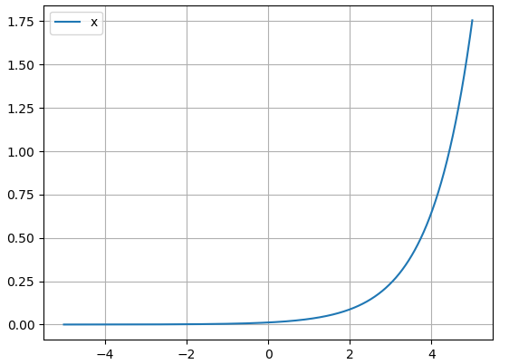
</div>

+ **softmax**<br>是Logistic的多分类一般化归纳，又称归一化指数函数，这个函数本身的作用显而易见，softmax函数将各类别的得分视为对数概率，所以首先进行exp操作然后归一化，将结果压缩为0到1的概率值。而所谓SOFTmax其实是对max的一种模拟，根据上图和函数中的exp操作可以看出，softmax是在有意扩大高低分之间的差距，更趋近max函数\[0, 0, ... , 1, ... ,0\]的one-hot形式vector，用SOFTmax不用max的原因是，max不可导（虽然可以求次梯度但不平滑），相比之下Softmax+Cross-Entropy-Loss从上文我的公式推导可以看出，能够求得非常简洁的梯度算式，关于交叉熵的详解和为什么要用交叉熵损失马上会提到。
+ **数值稳定**<br>Lecture里讲到过，从上文softmax公式也可以看出，显而易见的是经过exp处理后数值会发生上溢，且如果得分很少，比如W在训练开始时数值很小，分母会有下溢为0的可能，除以0也会导致结果出错。应对方案——softmax的分子分母同时乘一个常数C，常数可以写进exp里为logC，如果让logC is maxS，则一方面打分函数最大值为0，exp函数上限变为1，消除了上溢的可能；另一方面可以保证分子至少有一个1，不会发生除以0的情况，也没了下溢的风险。
+ **交叉熵**<br>这部分推荐看一看花书，信息论中一个事件的**自信息**定义为I=-logP(x)，P(x)是事件发生的概率，即认为较不可能发生的事件具有更高的信息量，自信息只对应单个事件，我们用**信息熵/香农熵**来量化整个概率分布中的不确定性总量或者说信息总量，H(x)=E(I)=-E(logP(x))，另有**相对熵/KL散度**来衡量两个分布之间的差异，或者说用Q(x)对P(x)建模的近似程度，$D_{KL}(P||Q)=\mathbb E_{x\sim P}[log\frac{P(x)}{Q(x)}]=\mathbb E_{x\sim P}[log{P(x)}-log{Q(x)}]=\sum_x{P(x)log[\frac{P(x)}{Q(x)}]}$，注意这里x是满足真实概率分布P的，“真实”分布就是所有概率密度都分布在正确的类别上，即\[0, 0, ... , 1, ... ,0\]one-hot vector，这正是softmax中$p=\mathbb1()$的原因，**交叉熵**——$H(P,Q)=H(x) + D_{KL}(P||Q)=-\mathbb E_{x\sim P}[logP(x)] + \mathbb E_{x\sim P}[log{P(x)}-log{Q(x)}]=\mathbb E_{x\sim P}[-log{Q(x)}]$可以理解为信息熵和相对熵之和，那么由于真实分布的信息熵是个定值，最小化交叉熵的过程其实就是最小化两个分布之间的相对熵，即让两个分布尽可能相似/预测的概率分布尽可能接近真实概率分布。
+ **交叉熵损失函数（代价函数）**<br>即用交叉熵公式来算的损失函数，基本上是和softmax固定搭配同时出现的，有两个原因，一方面交叉熵损失函数需要输入一个概率，而softmax刚好可以提供这个概率；另一方面参见[softmax算法原理](#assignment1-softmax)，我写了很详细的证明，其中有一步，<br>
$$
\begin{equation}\begin{aligned}\nabla_{w_k}L_i=\frac{\partial L_i}{\partial p_\beta}\frac{\partial p_\beta}{\partial s_m}\frac{\partial s_m}{\partial w_k}=-\sum^c_\beta{ \text{p}_{i,\beta}}\frac{1}{p_\beta}\times{\begin{cases}p_\beta-p_\beta^2&\beta =m \\ -p_\beta p_m&\beta !=m\end{cases}}\times\mathbb1(m=k)x^{(i)}\end{aligned}\end{equation}
$$
，<br>可以发现前两个偏导正是交叉熵和softmax两个函数的偏导，其中pβ是刚好可以抵消的，如果没有softmax，求梯度过程中存在的1/pβ很容易导致溢出，总的来说，**softmax恰好填补了cross-entropy derivative numerically unstable(overflow)这个漏洞且满足了交叉熵的输入需求。**——这部分是我对softmax+cross-entropy-loss这个搭配的理解。
+ **到底为什么用交叉熵损失？**<br>**上面谈到了softmax/交叉熵的起源和理解，又谈到了两者搭配的优秀特性即总是共同出现的原因，这里如果想说明白交叉熵损失相较于MSE均方误差的优势，就要提到激活函数的概念**，上文中提到的softmax函数其实就是激活函数activation function，Lecture5里马上就会写到，简单来说，激活函数可以引入非线性因素，解决线性模型所不能解决的问题。当我们使用类似sigmoid（σ）的激活函数求梯度时，如果使用均方误差，梯度公式会是<br>$\nabla_WL=\frac{\partial L}{\partial W}=(y_{pred}-y)\sigma'\times x,\nabla_bL=\frac{\partial L}{\partial b}=(y_{pred}-y)\sigma'$，<br>这意味着损失函数的梯度和sigmoid的梯度是成正比的，<br><div align=center>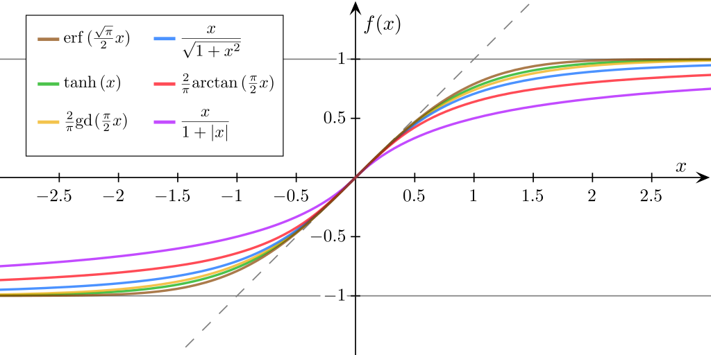</div><br>[sigmoid图源](https://en.wikipedia.org/wiki/Sigmoid_function)(sigmoid≠logistic!)，从上图的几种sigmoid函数图像可以看出，**sigmoid函数σ(z)在z很大或很小的时候由于sigmoid'极小，损失函数梯度都会非常小，即参数更新速度/训练速度（速率）很慢**，但实际上在初始化W后，打分很高或很低的情况时很常见的，**这时就会出现“错得越离谱，学得越慢”的自暴自弃现象**，是种很差的特性；同样是用sigmoid激活函数，如果用交叉熵损失，公式如下，<br>$\nabla_WL=\frac{\partial L}{\partial W}=x(\sigma-y),\nabla_bL=\frac{\partial L}{\partial b}=\sigma-y$，<br>相比之下，交叉熵损失中梯度大小只与z和真实值y相关，呈现出来的性质优于MSE，多分类问题也更倾向于应用交叉熵损失。

##### SVM vs. Softmax

<div align=center>

</div>

直观，一目了然。

##### Linear Classifier Demo可视化参数影响及训练过程

[knn and linear classifier demos](http://vision.stanford.edu/teaching/cs231n-demos/)，我也在这个repo里做了[备份](https://github.com/V2beach/cs231n/tree/main/demos)，以防今后网站迁移或域名更改，这个demo对理解非常有帮助。

### 线性分类器的评价

与[knn评价](#k-nn评价)对比来说，参数学习方法通过训练学习到参数就可以将训练数据丢掉了，预测只需要将数据与权重矩阵相乘，时间复杂度远小于训练。

# Lecture4 Neural Networks and Backpropagation

### Features
in slides and assignment, about Color Histogram and Histogram of Oriented Gradients

### 反向传播

>Notice that backpropagation is a beautifully local process.（反向传播是一个优美的局部过程。） Every gate in a circuit diagram gets some inputs and can right away compute two things: 1. its output value and 2. the local gradient of its output with respect to its inputs. Notice that the gates can do this completely independently without being aware of any of the details of the full circuit that they are embedded in. However, once the forward pass is over, during backpropagation the gate will eventually learn about the gradient of its output value on the final output of the entire circuit. Chain rule says that the gate should take that gradient and multiply it into every gradient it normally computes for all of its inputs.

>This extra multiplication (for each input) due to the chain rule can turn a single and relatively useless gate into a cog in a complex circuit such as an entire neural network.

官方笔记这段对bp的概括，很完整，讲得很透彻，下面是课上的具体例子，跟着算完就会了。

##### 反向传播的计算

<div align=center>
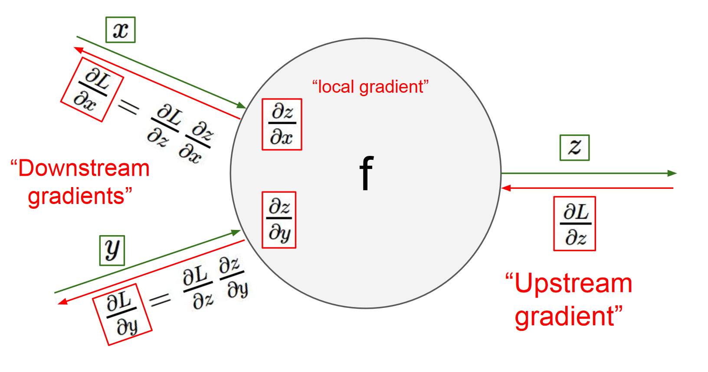
</div>

上图是计算图中每个单元的计算过程，正向将x和y代入f求z，反向用上游梯度∇zL乘x和y方向的本地梯度（代入中间值）∇xz, ∇yz求得下游梯度∇xL, ∇yL。

下图展示了计算的视觉化过程。前向传播从输入计算到输出（绿色），反向传播从尾部开始，根据链式法则递归地向前计算梯度（显示为红色），一直到网络的输入端。可以认为，梯度是从计算链路中回流。

<div align=center>
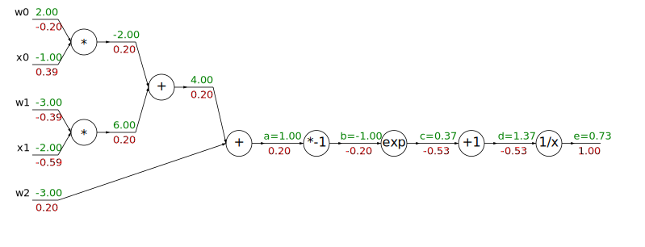
</div>

注意，正向时线上流动的是各函数的I/O，计算单元里存着f(x)之类的函数；而反向时线上流动的是gradient，计算单元里存的是求导公式。另外，正反向两个pass间，必须要理解的一个区别是，正向时（从左到右）如果一个节点输入连着两条线，这两个输入的运算方式由单元的函数决定，如果输出连着两条线，两条线上的输出是相同的，不同的输出对应不同的单元；**而反向时（从右到左）如果一个节点输入连着两条线，这俩gradient相加作为输入，如果输出连着两条线，两方向的求导公式不同。**

结合上图，用bp算一下后面相关I/O标了变量名的四个单元（即sigmoid_logistic）。

$\nabla_{sigmoid_{input}}{sigmoid_{output}}=\frac{\partial e}{\partial a}=\frac{\partial e}{\partial d}\frac{\partial d}{\partial c}\frac{\partial c}{\partial b}\frac{\partial b}{\partial a}=-\frac{1}{d^2}\times 1\times e^b\times -1$

从前到后分别代入中间值dcba。

##### 模块化计算单元

>我真的很喜欢思考计算图这样一个东西，这让我感觉非常开心。——[Serena Yeung](http://ai.stanford.edu/~syyeung/)

<div align=center>
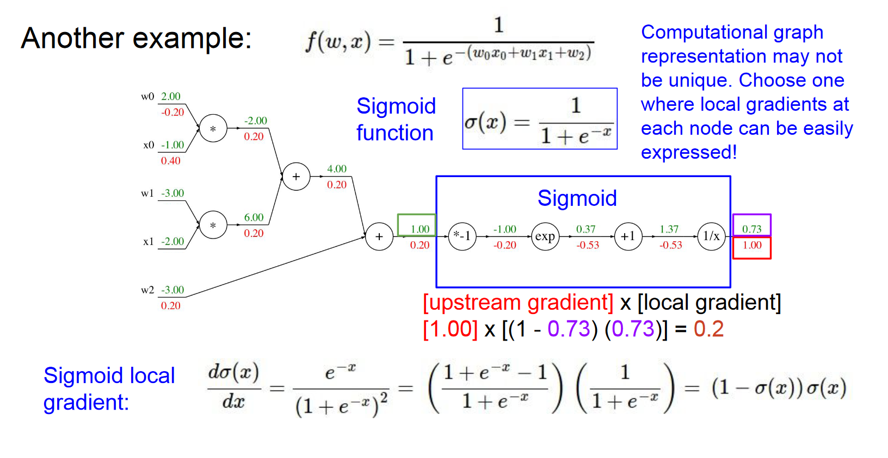
</div>

sigmoid其实可以被整合成一个计算单元，正向的计算公式为σ(x)=1/(1+e^-x)，反向的计算公式为(1-σ(x))σ(x)。

简化之后画计算图就是搭积木。

##### 实现时注意的点

>**对前向传播变量进行缓存**：在计算反向传播时，前向传播过程中得到的一些中间变量非常有用。在实际操作中，最好代码实现对于这些中间变量的缓存，这样在反向传播的时候也能用上它们。如果这样做过于困难，也可以（但是浪费计算资源）重新计算它们。

这个技巧其实在手撸ML算法的时候都会用到，包括上面的linear classifier和下面的two-layer neural network，求loss时用到的变量gradient会再用到。

>**在不同分支的梯度要相加**：如果变量x，y在前向传播的表达式中出现多次，那么进行反向传播的时候就要非常小心，使用+=而不是=来累计这些变量的梯度（不然就会造成覆写）。这是遵循了在微积分中的多元链式法则，该法则指出如果变量在线路中分支走向不同的部分，那么梯度在回传的时候，就应该进行累加。

这一点见[回传流中的模式](#回传流中的模式)图。

##### 回传流中的模式

<div align=center>
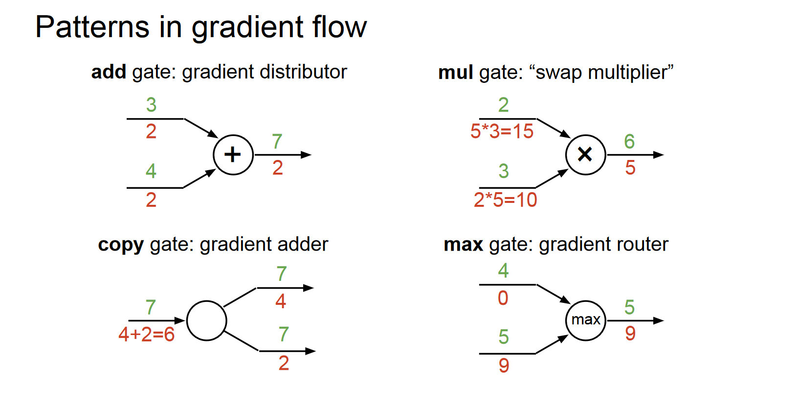
</div>

给反向回传流的计算单元起点好听的名字，正向的加法门是反向的梯度分发器，正向的乘法门是反向的梯度交换器，正向的max门是反向的梯度路由器（正向没对输出产生[影响](#注——)的输入不配拥有反向的梯度）。

##### 矩阵的Forward/Back Propagation

<div align=center>
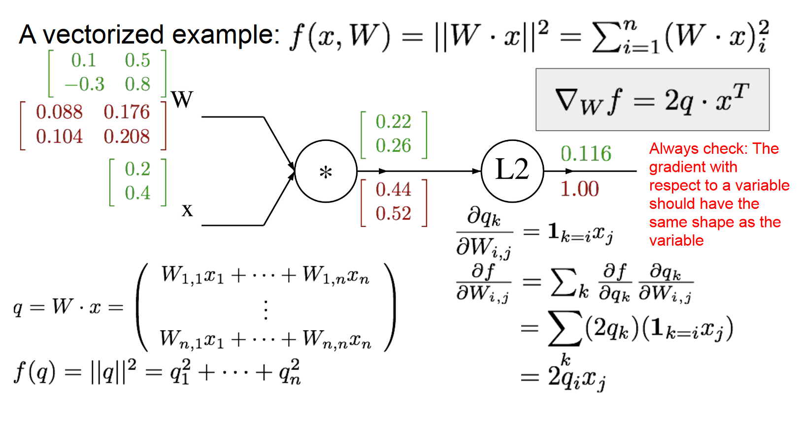
</div>

<div align=center>
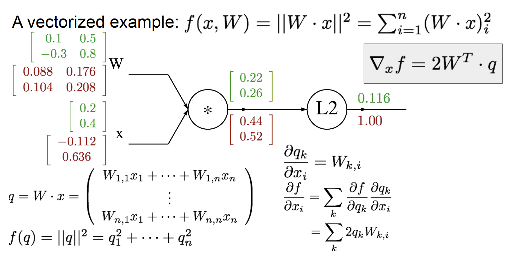
</div>

之前讨论的都是单个值的运算，矩阵在线上流动的求法其实也差不多，推过跟这里MSE类似的[softmax-cross entropy求梯度](#assignment1-softmax)时的公式，元素求导合成矩阵梯度时要注意维度，很多地方需要转置。

>使用小而具体的例子：有些读者可能觉得向量化操作的梯度计算比较困难，建议是写出一个很小很明确的向量化例子，在纸上演算梯度，然后对其一般化，得到一个高效的向量化操作形式。

### Assignment1 Two-Layer Neural Network

用到了bp的思想但是没有模块化计算，之后的代码都会被切分成如sigmoid/L2之类的单元，分别写代码。

##### 算法原理

是上文softmax和bp的组合。

+ 训练
    + 区别在于，中间多一层修正线性单元，且有两个W权重矩阵，hidden层的ReLU即f(x)=max(0,x)，求梯度时只需要找到上游梯度矩阵中正向值为0的位置筛为0即可传往下游。
+ 预测

##### 代码分析

跟之前不同的是，学到的参数是W和b，且被存在了self.params里面。

除此之外，跟svm和softmax的区别无非是多了一层ReLU，链式法则多接几个偏导，再重复写一次就太冗余了，所以详见[代码](https://github.com/V2beach/cs231n/blob/main/assignment1/cs231n/classifiers/neural_net.py)。

# 写在后面
用github render渲染出来的公式必然没有直接用mathjax那么整齐，github和知乎都不支持也是没办法的事，我会把report再在blog.v2beach.cn上传一遍。

# References
\[1\] [L1-norm和L2-norm两种范数的特点和区别？- Andy Yang](https://www.zhihu.com/question/26485586/answer/616029832)

\[2\] [CS231n官方笔记授权翻译 - 杜克et al.](https://zhuanlan.zhihu.com/p/21930884)

\[3\] [image classification notes](http://cs231n.github.io/classification), [linear classification notes](http://cs231n.github.io/linear-classify), [optimization notes](http://cs231n.github.io/optimization-1), [backprop notes](http://cs231n.github.io/optimization-2) - Fei-Fei Li et al.

\[4\] [cs229 Machine Learning - 吴恩达](https://www.coursera.org/learn/machine-learning)

\[5\] [机器学习中使用正则化来防止过拟合是什么原理？- 叶芃](https://www.zhihu.com/question/20700829/answer/119314862)

\[6\] [全微分 - 维基百科](https://zh.wikipedia.org/wiki/全微分)

\[7\] [如何直观形象的理解方向导数与梯度以及它们之间的关系？- 马同学](https://www.zhihu.com/question/36301367/answer/156102040)

\[8\] [如何直观形象的理解方向导数与梯度以及它们之间的关系？- 忆臻](https://www.zhihu.com/question/36301367/answer/142096153)

\[9\] [梯度是向量，方向导数是一个数 - BoniuPoniu](https://blog.csdn.net/weixin_43702920/article/details/107435227)

\[10\] [统计学习方法 - 李航](https://www.google.com/)

\[11\] [CS231 作业1 - Doraemonzzz](https://doraemonzzz.com/2019/03/02/CS231 作业1)

\[12\] [Softmax损失函数及梯度的计算 - 杨勇](https://zhuanlan.zhihu.com/p/21485970)

\[13\] [详解softmax函数以及相关求导过程 - 忆臻](https://zhuanlan.zhihu.com/p/25723112)（SCIR）

\[14\] [多类分类下为什么用softmax而不是用其他归一化方法? - 各回答](https://www.zhihu.com/question/40403377)

\[15\] [交叉熵损失函数相比平方差损失函数的优点？ - __鸿](https://blog.csdn.net/u014313009/article/details/51043064)